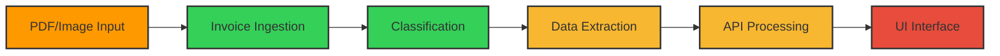
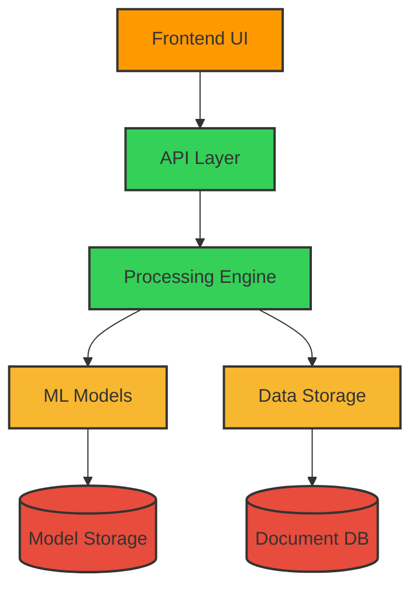

# Document Processing System 🚀

<div align="center">

[](https://www.python.org/)
[](https://github.com/shajith240/INVOICE-SCRAPING-SYSTEM/actions)
[](https://codecov.io/gh/shajith240/INVOICE-SCRAPING-SYSTEM)
[](https://github.com/shajith240/INVOICE-SCRAPING-SYSTEM/blob/main/LICENSE)
[](https://github.com/shajith240/INVOICE-SCRAPING-SYSTEM/releases)

<h3>🌟 Intelligent Invoice Processing System</h3>

[Features](#-key-features) • [Installation](#%EF%B8%8F-installation) • [Usage](#-quick-start) • [Documentation](#-documentation) • [Contributing](#-contributing)

</div>

## 🎯 Project Overview

A state-of-the-art invoice processing system that leverages advanced machine learning and natural language processing to automate the extraction and categorization of information from various invoice formats.

<div align="center">



</div>

## 📊 Project Status

<div align="center">

| Phase | Status | Progress |
|:------|:------:|:--------:|
| Phase 1: Invoice Ingestion | ✅ Complete |  |
| Phase 2: Invoice Classification | ✅ Complete |  |
| Phase 3: Data Extraction | 🚧 In Progress |  |
| Phase 4: API Development | 🚧 In Progress |  |
| Phase 5: Email Automation | 🚧 In Progress |  |
| Phase 6: UI Development | ⏳ Planned |  |

</div>

## 🚀 Key Features

<div align="center">

| Feature | Description | Status |
|:--------|:------------|:------:|
| 📄 Multi-Format Support | Process PDF, Images, and Scanned documents | ✅ |
| 🤖 Auto Categorization | Intelligent invoice classification and validation | ✅ |
| 📊 Smart Extraction | Extract amounts, dates, and vendor details automatically | 🚧 |
| 🔄 Processing Pipeline | Configurable and extensible processing workflow | ✅ |
| 📝 Detailed Logging | Comprehensive logging and error handling | ✅ |
| 🔄 Real-time Status | Live processing status updates | ✅ |
| 📦 Batch Processing | Process multiple invoices simultaneously | ✅ |

</div>

## ⚙️ Installation

```bash
# Clone the repository
git clone https://github.com/shajith240/INVOICE-SCRAPING-SYSTEM.git
cd INVOICE-SCRAPING-SYSTEM

# Create and activate virtual environment
python -m venv venv
source venv/bin/activate  # Linux/macOS
# or
venv\Scripts\activate     # Windows

# Install dependencies
pip install -r requirements.txt
```

## 💻 Quick Start

```python
from src.invoice_processor import InvoiceProcessor

# Initialize processor
processor = InvoiceProcessor('config.json')

# Process single invoice
result = processor.process_invoice('path/to/invoice.pdf')

# Process batch of invoices
results = processor.process_batch('path/to/invoice/directory')
```

## 🧪 Testing

```bash
# Run the test suite with coverage
python -m pytest tests/ --cov=src
```

## 📚 Documentation

- [📖 API Documentation](https://github.com/shajith240/INVOICE-SCRAPING-SYSTEM/wiki/API-Documentation)
- [📚 User Guide](https://github.com/shajith240/INVOICE-SCRAPING-SYSTEM/wiki/User-Guide)
- [🤝 Contributing Guidelines](CONTRIBUTING.md)
- [📋 Change Log](CHANGELOG.md)

## 📊 System Architecture

<div align="center">



</div>

## 📈 Project Statistics

<div align="center">

[](https://github.com/shajith240/INVOICE-SCRAPING-SYSTEM/commits/main)
[](https://github.com/shajith240/INVOICE-SCRAPING-SYSTEM/issues)
[](https://github.com/shajith240/INVOICE-SCRAPING-SYSTEM/pulls)
[](https://github.com/shajith240/INVOICE-SCRAPING-SYSTEM/graphs/contributors)

</div>

## 🤝 Contributing

We welcome contributions! Please see our [Contributing Guidelines](CONTRIBUTING.md) for details.

## 📄 License

This project is licensed under the MIT License - see the [LICENSE](LICENSE) file for details.

---

<div align="center">
<p>Made with ❤️ by Shajith</p>
<p>© 2024 All rights reserved.</p>

[](https://star-history.com/#shajith240/INVOICE-SCRAPING-SYSTEM&Date)

</div>
