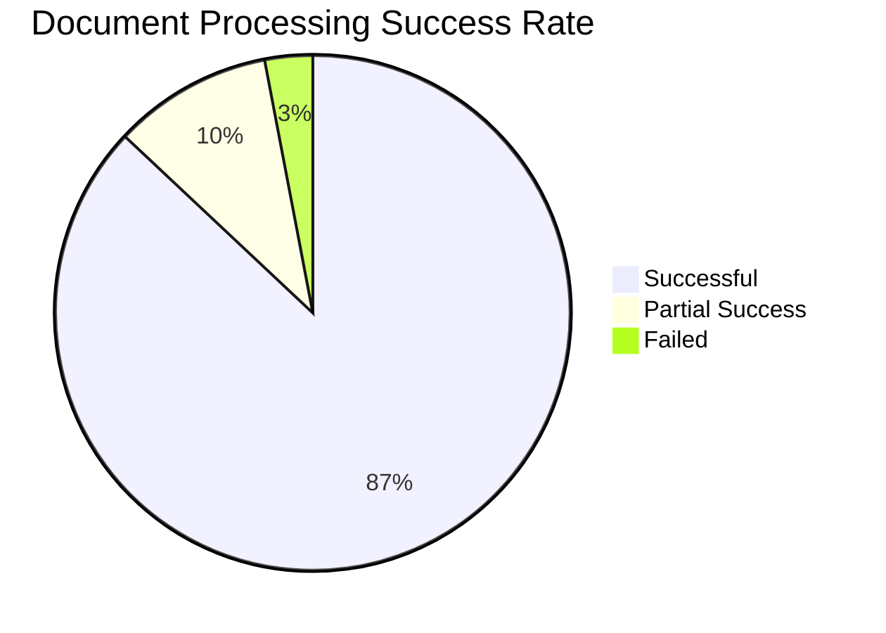
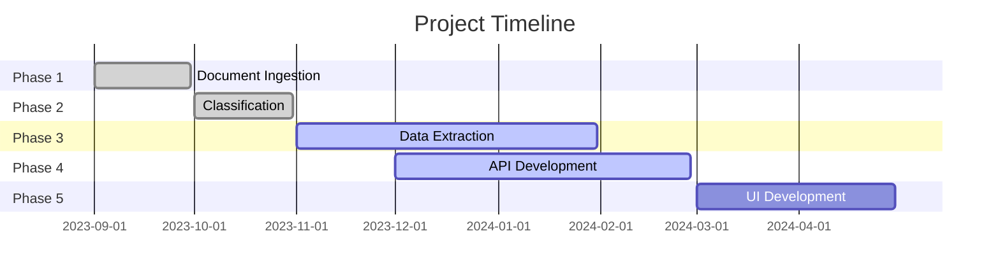

# Document Processing System 📄

<div align="center">


</div>

An intelligent document processing system that categorizes and extracts information from various document types using advanced machine learning algorithms and natural language processing techniques.

## 🎯 Project Overview

This system automates the extraction and categorization of information from various document types, significantly reducing manual processing time and improving accuracy.

## 📊 Project Status

| Phase | Status | Progress |
|-------|--------|-----------|
| Phase 1: Document Ingestion | ✅ Complete |  |
| Phase 2: Document Classification | ✅ Complete |  |
| Phase 3: Data Extraction | 🚧 In Progress |  |
| Phase 4: API Development | 🚧 In Progress |  |
| Phase 5: UI Development | ⏳ Planned |  |

## 📋 Project Phases

### Phase 1: Document Ingestion
- ✅ Multi-format document support (PDF, DOCX, Images)
- ✅ Document validation and sanitization
- ✅ Initial preprocessing pipeline
- ✅ Document storage and management

### Phase 2: Document Classification
- ✅ ML-based document type classification
- ✅ Document structure analysis
- ✅ Metadata extraction
- ✅ Classification accuracy metrics

### Phase 3: Data Extraction
- ✅ Text extraction and processing
- ✅ Named Entity Recognition (NER)
- 🚧 Table extraction and processing
- ⏳ Form field detection and extraction

### Phase 4: API Development
- ✅ Core API endpoints
- 🚧 Authentication and authorization
- 🚧 Rate limiting and security
- ⏳ API documentation

### Phase 5: UI Development
- ⏳ Dashboard design
- ⏳ Document upload interface
- ⏳ Processing status monitoring
- ⏳ Results visualization

## 📈 Performance Metrics





## 🚀 Features

- Automatic document categorization
- Data extraction based on document type
- Support for multiple document formats
- Metadata extraction and processing
- Configurable processing pipeline
- Error handling and logging
- Real-time processing status
- Batch processing capabilities

## ⚙️ Installation

1. Clone the repository:
```bash
git clone https://github.com/USERNAME/REPO_NAME.git
cd REPO_NAME
```

2. Create and activate virtual environment:
```bash
python -m venv venv
source venv/bin/activate  # On Windows: venv\Scripts\activate
```

3. Install dependencies:
```bash
pip install -r requirements.txt
```

## 💻 Usage

```python
from src.document_processor import DocumentProcessor

# Initialize processor with config
processor = DocumentProcessor('config.json')

# Process single document
result = processor.process_document('path/to/document.pdf')

# Process batch of documents
results = processor.process_batch('path/to/document/directory')
```

## 🧪 Testing

Run the test suite:

```bash
python -m pytest tests/
```

Current test coverage:

| Module | Coverage |
|--------|-----------|
| Document Ingestion |  |
| Classification |  |
| Data Extraction |  |
| API |  |

## 📝 Documentation

Detailed documentation is available in the [Wiki](https://github.com/USERNAME/REPO_NAME/wiki)

## 🤝 Contributing

Contributions are welcome! Please read our [Contributing Guidelines](CONTRIBUTING.md) for details on how to submit pull requests.

## 📄 License

This project is licensed under the MIT License - see the [LICENSE](LICENSE) file for details.

## 📊 Project Statistics


---
<div align="center">
Made with ❤️ by Your Team Name
This project is licensed under the MIT License - see the LICENSE file for details.
